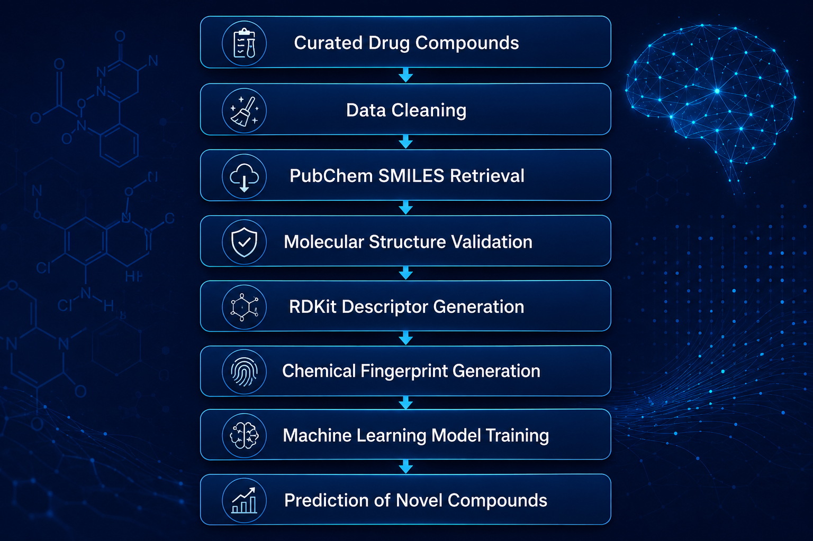
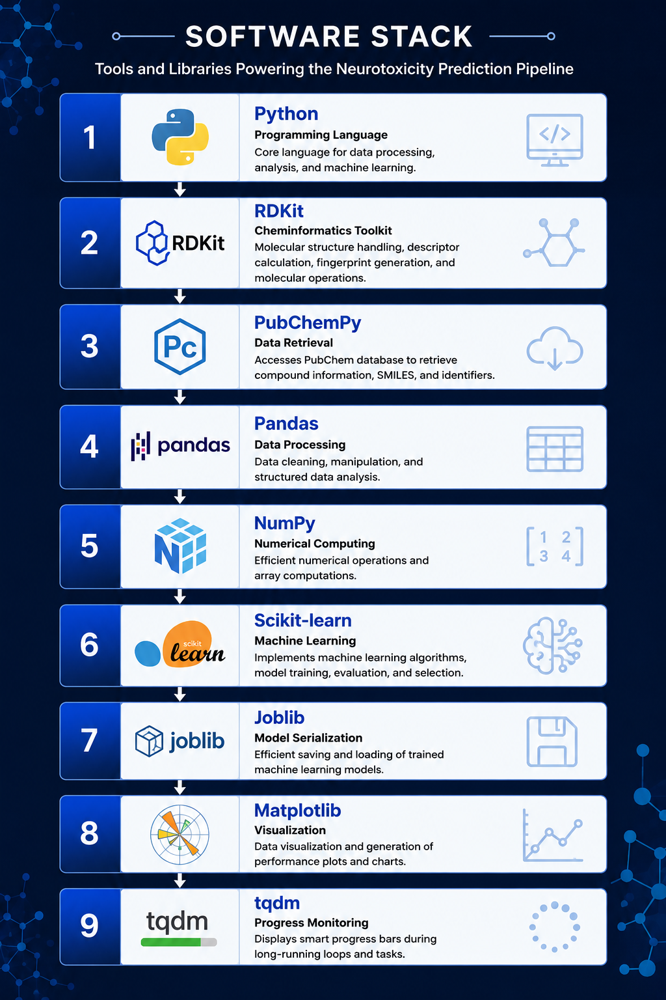
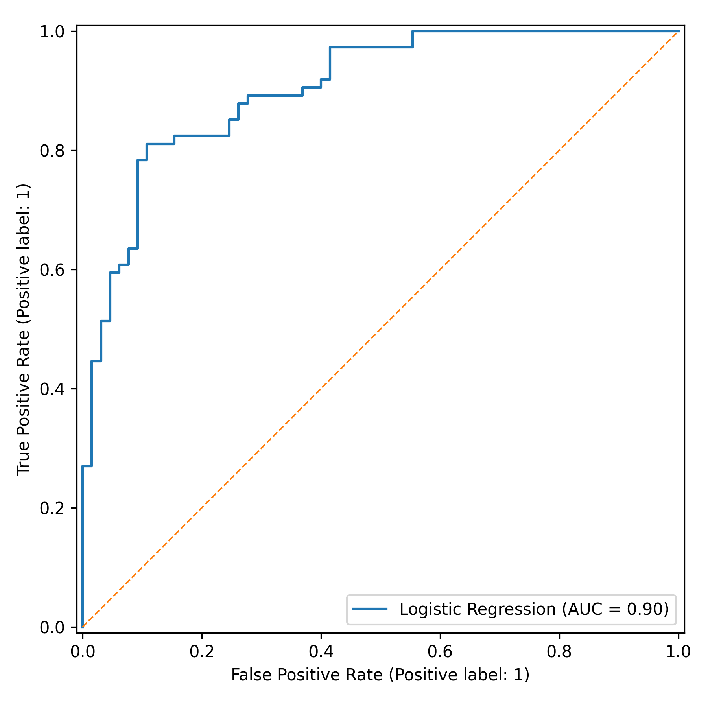
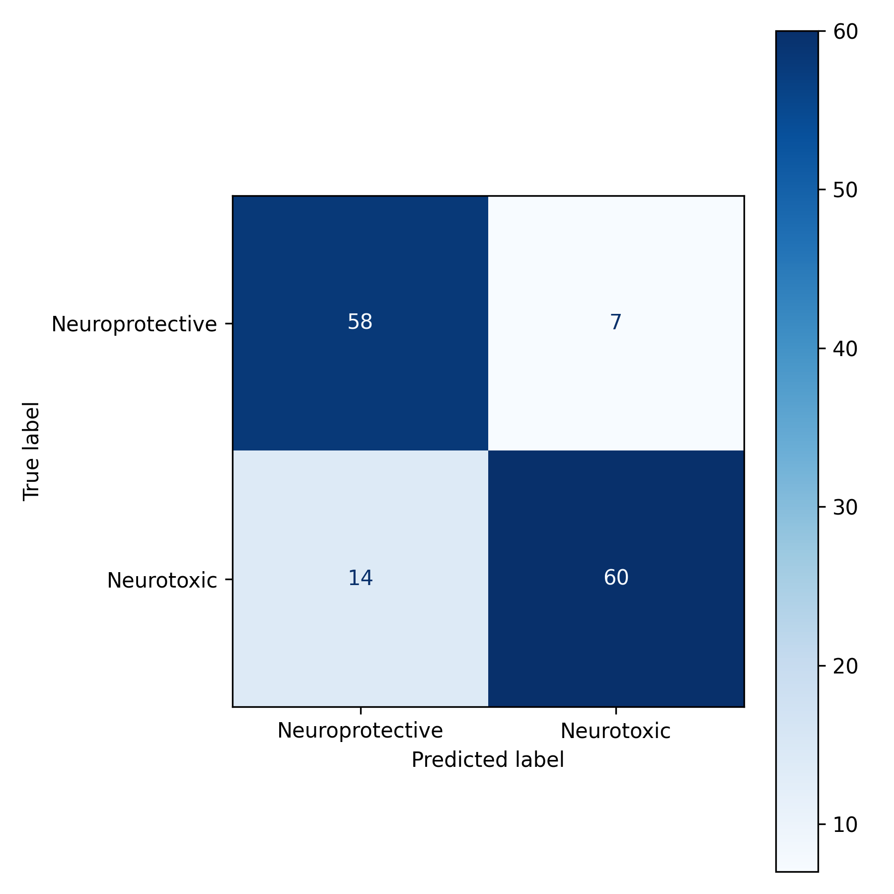
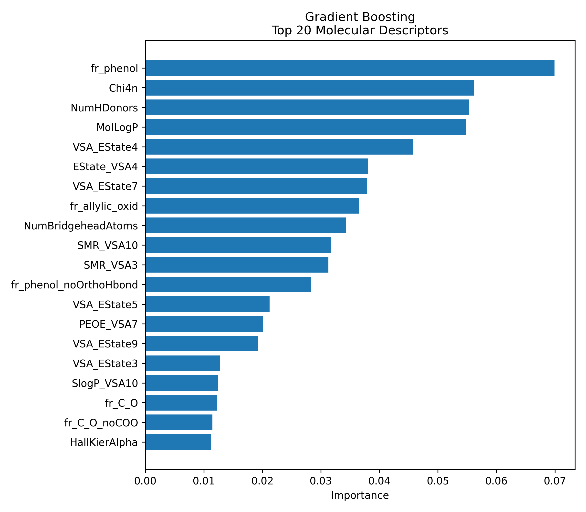
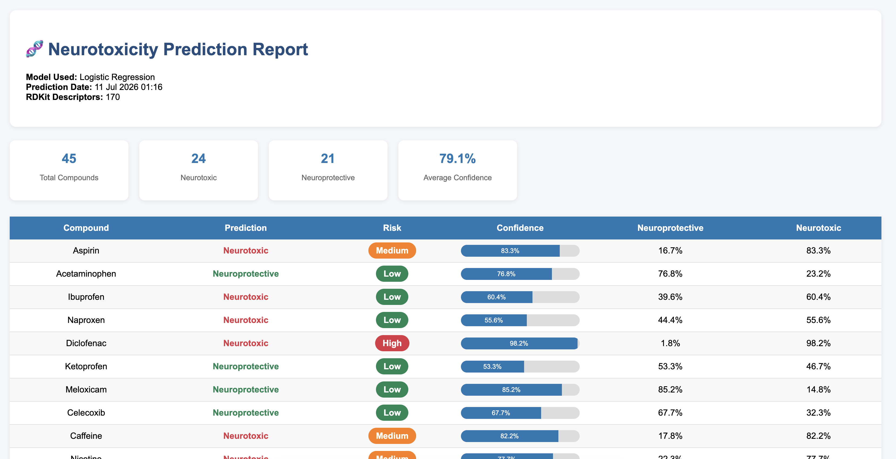

<p align="center">
  
</p>

<h1 align="center">
🧠 Machine Learning-Based Neurotoxicity Prediction
</h1>

<p align="center">
Predicting Drug-Induced Neurotoxicity using Molecular Descriptors and Artificial Intelligence

A reproducible machine learning framework for early prediction of drug-induced neurotoxicity using molecular descriptors, cheminformatics, and supervised machine learning algorithms.

</p>

<p align="center">


</p>

---

# 🧬 Overview

Drug-induced neurotoxicity is a major challenge during drug discovery and development. Traditional laboratory evaluation is often expensive and time-consuming, motivating the development of computational approaches for early toxicity screening.

This project presents a machine learning pipeline that predicts the neurotoxicity potential of chemical compounds using molecular descriptors generated from their chemical structures. The workflow integrates chemoinformatics, feature engineering, and supervised machine learning to classify compounds as neurotoxic or neuroprotective.

The complete pipeline covers:

- Curating neuroactive compounds
- Retrieving molecular structures from PubChem
- Generating molecular descriptors using RDKit
- Data preprocessing and feature engineering
- Machine learning model development
- Model evaluation and prediction of novel compounds

---

# 🎯 Project Objectives

This project aims to:

- Develop an end-to-end neurotoxicity prediction pipeline.
- Predict neurotoxicity from molecular descriptors.
- Automate molecular structure retrieval using PubChem.
- Generate molecular descriptors and fingerprints using RDKit.
- Train and evaluate machine learning classification models.
- Predict neurotoxicity of previously unseen compounds.
- Build a modular and reproducible computational workflow.

---

# ✨ Project Highlights

- ✅ End-to-End Machine Learning Pipeline
- ✅ Automated PubChem Integration
- ✅ RDKit Molecular Descriptor Generation
- ✅ Chemical Fingerprint Generation
- ✅ Supervised Machine Learning Models
- ✅ Prediction of Novel Compounds
- ✅ Modular Python Workflow
- ✅ Reproducible Research Pipeline

---

# 🚀 Repository Workflow

<p align="center">



</p>

The computational workflow consists of multiple automated stages beginning with curated drug compounds and ending with prediction of neurotoxicity for previously unseen molecules.

The major stages include:

1. Curated Drug Compounds
2. Data Cleaning
3. PubChem SMILES Retrieval
4. Molecular Structure Validation
5. RDKit Descriptor Generation
6. Chemical Fingerprint Generation
7. Machine Learning Model Training
8. Prediction of Novel Compounds

---

# 🤖 Machine Learning Pipeline

<p align="center">


</p>

The machine learning workflow follows standard supervised learning practices for cheminformatics applications.

Pipeline stages include:

- Molecular Descriptor Generation
- Feature Engineering
- Data Preprocessing
- Train-Test Split
- Model Training
- Cross Validation
- Performance Evaluation
- Prediction

---

# 📊 Why Machine Learning for Neurotoxicity?

Traditional experimental toxicity screening is:

- expensive
- time-consuming
- labor intensive
- low throughput

Machine learning provides an efficient alternative by learning relationships between molecular properties and biological activity, enabling rapid screening of thousands of compounds before experimental validation.

This computational approach can substantially reduce the cost and duration of early-stage drug discovery.

---

# 🔬 Applications

The workflow can be applied to:

- Drug Discovery
- Computational Toxicology
- Medicinal Chemistry
- Pharmaceutical Research
- Virtual Screening
- Lead Compound Prioritization
- Chemical Risk Assessment
- Bioinformatics Research

---

# 🛠️ Technology Stack

<p align="center">



</p>

The project integrates widely adopted open-source tools from cheminformatics, machine learning, and scientific computing.

| Category | Technology | Purpose |
|-----------|------------|---------|
| Programming Language | Python | Workflow development |
| Chemical Database | PubChem | Compound information & SMILES retrieval |
| Cheminformatics | RDKit | Molecular descriptors & fingerprints |
| Data Processing | Pandas | Data manipulation |
| Numerical Computing | NumPy | Numerical operations |
| Machine Learning | Scikit-learn | Classification models |
| Visualization | Matplotlib | Scientific plotting |
| Visualization | Seaborn | Statistical graphics |

---

---

# ⚙️ Installation

Follow these steps to set up the project locally.

## 1. Clone the Repository

```bash
git clone https://github.com/AbhimanyuMandal/Neurotoxicity-Prediction-ML.git
cd Neurotoxicity-Prediction-ML
```

## 2. Create a Virtual Environment (Optional)

**Windows**

```bash
python -m venv venv
venv\Scripts\activate
```

**Linux / macOS**

```bash
python3 -m venv venv
source venv/bin/activate
```

## 3. Install Required Packages

```bash
pip install -r requirements.txt
```

---

# 🚀 Running the Pipeline

The workflow can be executed step-by-step using the scripts provided.

### Generate Molecular Descriptors

```bash
python scripts/01_generate_descriptors.py
```

### Preprocess the Dataset

```bash
python scripts/02_preprocess_data.py
```

### Train Machine Learning Models

```bash
python scripts/06_train_models.py
```

### Predict Novel Compounds

```bash
python scripts/07_predict_new_compounds.py
```

Generated models, predictions, figures, and reports will automatically be saved in their respective directories.

---

# 📂 Repository Structure

```text
Neurotoxicity-Prediction-ML/

│
├── README.md
├── LICENSE
├── requirements.txt
├── .gitignore
│
├── assets/
│   ├── banner.png
│   ├── workflow.png
│   ├── ML pipeline.png
│   └── software_stack.png
│
├── data/
│   ├── raw/
│       ├── candidate_compounds.csv
│   └── processed/
│       └── new_compounds.csv
│
├── scripts/
│   ├── 01_clean_candidate_list.py
│   ├── 02_fetch_pubchem.py
│   ├── 03_validate_structures.py
│   ├── 04_generate_rdkit_descriptors.py
│   ├── 05_generate_fingerprints.py
│   ├── 06_train_models.py
│   ├── 07_predict_new_compounds.py
│   └── check_descriptors.py
│
├── models/
│   ├── Logistic_Regression.joblib
│   ├── Random_Forest.joblib
│   ├── Support_Vector_Machine.joblib
│   ├── best_model.joblib
│   └── feature_columns.pkl
├── figures/
│   ├── confusion_matrix.png
│   ├── feature_importance.png
│   └── roc_curve.png
├── reports/
│   ├── feature_importance.csv
│   ├── metrics.txt
│   ├── model_comparison.csv
│   ├── prediction_report.csv
│   └── prediction_report.html
├── src/
│   ├── _init_.py
│   ├── pubchem_client.py
│   └── utils.py
└── utils/
│   ├── categories.py
│   ├── cleaner.py
│   └── constants.py
```

The repository follows a modular organization to improve readability, reproducibility, and future scalability.

---

# ⚙️ Pipeline Components

The project consists of several computational stages.

---

## 1️⃣ Compound Curation

### Objective

Create a curated dataset of neurotoxic and neuroprotective compounds for supervised learning.

### Tasks

- Compound collection
- Duplicate removal
- Label assignment
- Dataset validation

### Output

Clean labelled compound dataset

---

## 2️⃣ Molecular Structure Retrieval

### Objective

Retrieve molecular structures from PubChem.

### Tasks

- Query PubChem
- Download canonical SMILES
- Validate molecular identifiers

### Output

Canonical SMILES dataset

---

## 3️⃣ Molecular Descriptor Generation

### Objective

Transform molecular structures into numerical features.

### Tasks

- RDKit descriptor calculation
- Physicochemical properties
- Topological descriptors
- Molecular fingerprints

### Output

Descriptor matrix

---

## 4️⃣ Data Preprocessing

### Objective

Prepare descriptors for machine learning.

### Tasks

- Missing value handling
- Duplicate removal
- Feature selection
- Data normalization

### Output

Machine-learning-ready dataset

---

## 5️⃣ Feature Engineering

### Objective

Improve predictive performance.

### Tasks

- Remove low variance features
- Remove redundant descriptors
- Descriptor optimization

### Output

Optimized feature matrix

---

## 6️⃣ Machine Learning

### Objective

Train predictive classification models.

### Tasks

- Train/Test Split
- Model fitting
- Hyperparameter optimization
- Cross Validation

### Output

Trained predictive model

---

## 7️⃣ Model Evaluation

### Objective

Evaluate predictive performance.

### Metrics

- Accuracy
- Precision
- Recall
- F1 Score
- ROC-AUC
- Confusion Matrix

### Output

Model performance report

---

## 8️⃣ Prediction

### Objective

Predict neurotoxicity of unseen compounds.

### Output

Predicted toxicity labels

---

# 📦 Dataset

The project uses curated chemical compounds labelled according to their reported neurotoxicity.

## Dataset Characteristics

- Binary Classification Problem
- Neurotoxic Compounds
- Neuroprotective Compounds
- Canonical SMILES Representation
- Molecular Descriptor Features
- Chemical Fingerprints

Each compound is converted into numerical molecular descriptors suitable for machine learning using RDKit.

---

---

# 🧬 Feature Engineering & Descriptor Selection

Molecular descriptors generated from chemical structures often contain redundant, low-information, or unstable features. Proper feature engineering is essential to improve model performance, reduce overfitting, and enhance computational efficiency.

### Current Feature Engineering Workflow

The pipeline performs several preprocessing and quality-control steps before model training:

- Removal of invalid molecular structures
- Elimination of descriptors containing missing or non-numeric values
- Removal of constant and near-constant descriptors
- Descriptor quality filtering to retain informative molecular features
- Construction of molecular fingerprints (Morgan/ECFP4) for structure-based learning

These preprocessing steps ensure that only high-quality descriptors are used for downstream machine learning.

---

### Why Feature Selection Matters

Reducing descriptor redundancy offers several advantages:

- Improves model generalization
- Reduces computational complexity
- Minimizes overfitting
- Enhances model interpretability
- Removes noisy or non-informative variables

Effective feature engineering is particularly important in cheminformatics, where hundreds of molecular descriptors can be generated from a single compound.

---

### Future Enhancements

Future versions of the pipeline may incorporate additional dimensionality reduction and feature-selection techniques, including:

- Variance Threshold Filtering
- Correlation-Based Feature Selection
- Recursive Feature Elimination (RFE)
- Principal Component Analysis (PCA)
- Mutual Information-Based Selection
- SHAP-Based Feature Importance

These methods can further improve model robustness while providing greater insight into the molecular properties most strongly associated with neurotoxicity.

---

# 📈 Machine Learning Models

The workflow supports multiple supervised learning algorithms.

Current models include:

- Logistic Regression
- Support Vector Machine (SVM)
- Random Forest

The modular workflow allows additional models to be integrated with minimal modifications.

---

# 📊 Results

The developed machine learning pipeline successfully predicts the neurotoxicity potential of chemical compounds using molecular descriptors generated from chemical structures.

The workflow demonstrates the complete cheminformatics pipeline:

- Curated compound dataset
- Molecular descriptor generation
- Feature engineering
- Machine learning classification
- Performance evaluation
- Prediction of unseen compounds

> **Note**
>
> Model performance will be updated after final training on the complete curated dataset.

---

# 📈 Model Evaluation

The following evaluation metrics are used to compare machine learning models.

| Metric | Description |
|---------|-------------|
| Accuracy | Overall prediction performance |
| Precision | Positive prediction quality |
| Recall | Sensitivity towards neurotoxic compounds |
| F1 Score | Balance between Precision and Recall |
| ROC-AUC | Classification capability |
| Confusion Matrix | Detailed prediction summary |

Visualizations include:

- ROC Curve
- Confusion Matrix
- Feature Importance

---

---

# 📊 Results and Visualizations

The trained machine learning models were evaluated using multiple classification metrics to assess predictive performance on unseen compounds.

The following visualizations summarize the overall performance of the neurotoxicity prediction pipeline.

## 📉 Receiver Operating Characteristic (ROC) Curve

The ROC curve illustrates the trade-off between sensitivity and specificity across different decision thresholds. A larger Area Under the Curve (AUC) indicates better classification performance.

<p align="center">

</p>

## 🔲 Confusion Matrix

The confusion matrix summarizes the prediction outcomes by comparing the true class labels against the predicted labels.

<p align="center">

</p>

## ⭐ Feature Importance

The most informative molecular descriptors contributing to neurotoxicity prediction are shown below.

<p align="center">

</p>

---

# 🔄 Reproducibility

The workflow has been designed following reproducible research practices.

Features include:

- Modular Python scripts
- Version-controlled source code
- Standardized project structure
- Open-source software
- Fixed random seeds
- Documented workflow
- Easily extendable pipeline

---

## 📑 Automated HTML Report

The pipeline automatically generates a comprehensive HTML report summarizing the dataset, molecular descriptors, feature distributions, missing value analysis, and machine learning performance. This report provides an interactive overview of the complete neurotoxicity prediction workflow.

<p align="center">
  
</p>

<p align="center">
  <em>Figure: Preview of the automatically generated HTML analysis report.</em>
</p>

> The complete report is generated automatically during execution and can be found in the `reports/` directory after running the pipeline.

---

# 🚀 Future Improvements

Potential future enhancements include:

- Increase compound database to 1000+ molecules
- Hyperparameter optimization
- XGBoost implementation
- SHAP explainability
- Web application using Streamlit
- Docker deployment

---

# 📚 References

### Software

This project utilizes several open-source scientific libraries including:

- RDKit
- PubChemPy
- Scikit-learn
- XGBoost
- Pandas
- NumPy
- SHAP
- Matplotlib
- Seaborn

Please cite the respective software packages if used in scientific research.

---

# 📄 License

This project is licensed under the **MIT License**.

See the **LICENSE** file for additional details.

---

# 📖 Citation

If you use this repository in your research, please cite:

```text
Mandal A.
Neurotoxicity Prediction Using Machine Learning and Molecular Descriptors.
GitHub Repository.
```

Citation information will be updated following publication.

---

# 👨‍💻 Author

## Abhimanyu Mandal

Computational Biologist • Bioinformatics Researcher • Machine Learning Enthusiast

🌐 **Portfolio**

https://abhimanyumandal.github.io/Personal-Portfolio/

💼 **LinkedIn**

https://www.linkedin.com/in/abhimanyu-mandal/

📧 **Email**

abhimanyumandal0810@gmail.com

---

# 🙏 Acknowledgements

This project was inspired by the application of cheminformatics and machine learning for computational toxicity prediction.

Special thanks to:

- PubChem
- RDKit Community
- Scikit-learn Developers
- Open-source Scientific Computing Community

---

<div align="center">

### ⭐ If you found this repository useful, please consider giving it a Star!

**Building interpretable machine learning models for computational neurotoxicity prediction.**

</div>
