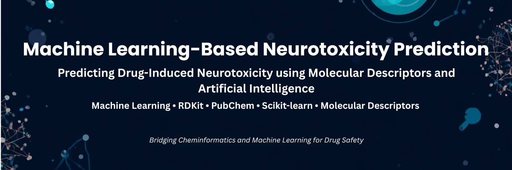

  

<h1 align="center">
Machine Learning-Based Neurotoxicity Prediction
</h1>

Predicting Drug-Induced Neurotoxicity using Molecular Descriptors and Artificial Intelligence

---

# 🧠 Overview

Drug-induced neurotoxicity is a major challenge in pharmaceutical research and clinical therapeutics, often leading to severe neurological complications, treatment discontinuation, and failure during drug development.

Early computational prediction of neurotoxicity enables researchers to identify potentially harmful compounds before expensive laboratory experiments, accelerating safer drug discovery while reducing both cost and time.

This repository presents an **end-to-end machine learning pipeline** for predicting neurotoxicity from molecular structures using molecular descriptors and chemical fingerprints. The workflow integrates automated compound curation, molecular structure retrieval, descriptor generation, feature engineering, supervised machine learning, and prediction of previously unseen compounds.

The project combines **Cheminformatics**, **Computational Toxicology**, and **Machine Learning** into a reproducible research workflow suitable for drug discovery applications.

---

# 🎯 Project Objectives

This project aims to:

- Develop an end-to-end neurotoxicity prediction pipeline.
- Predict neurotoxicity from molecular descriptors.
- Automate molecular structure retrieval using PubChem.
- Generate molecular descriptors and fingerprints using RDKit.
- Train and evaluate machine learning classification models.
- Predict neurotoxicity of previously unseen compounds.
- Build a modular and reproducible computational workflow.

---

# ✨ Project Highlights

- ✅ End-to-End Machine Learning Pipeline
- ✅ Automated PubChem Integration
- ✅ RDKit Molecular Descriptor Generation
- ✅ Chemical Fingerprint Generation
- ✅ Supervised Machine Learning Models
- ✅ Prediction of Novel Compounds
- ✅ Modular Python Workflow
- ✅ Reproducible Research Pipeline

---

# 🚀 Repository Workflow

The computational workflow consists of multiple automated stages beginning with curated drug compounds and ending with prediction of neurotoxicity for previously unseen molecules.

The major stages include:

1. Curated Drug Compounds
2. Data Cleaning
3. PubChem SMILES Retrieval
4. Molecular Structure Validation
5. RDKit Descriptor Generation
6. Chemical Fingerprint Generation
7. Machine Learning Model Training
8. Prediction of Novel Compounds

---

# 🤖 Machine Learning Pipeline

The machine learning workflow follows standard supervised learning practices for cheminformatics applications.

Pipeline stages include:

- Molecular Descriptor Generation
- Feature Engineering
- Data Preprocessing
- Train-Test Split
- Model Training
- Cross Validation
- Performance Evaluation
- Prediction

---

# 📊 Why Machine Learning for Neurotoxicity?

Traditional experimental toxicity screening is:

- expensive
- time-consuming
- labor intensive
- low throughput

Machine learning provides an efficient alternative by learning relationships between molecular properties and biological activity, enabling rapid screening of thousands of compounds before experimental validation.

This computational approach can substantially reduce the cost and duration of early-stage drug discovery.

---

# 🔬 Applications

The workflow can be applied to:

- Drug Discovery
- Computational Toxicology
- Medicinal Chemistry
- Pharmaceutical Research
- Virtual Screening
- Lead Compound Prioritization
- Chemical Risk Assessment
- Bioinformatics Research
